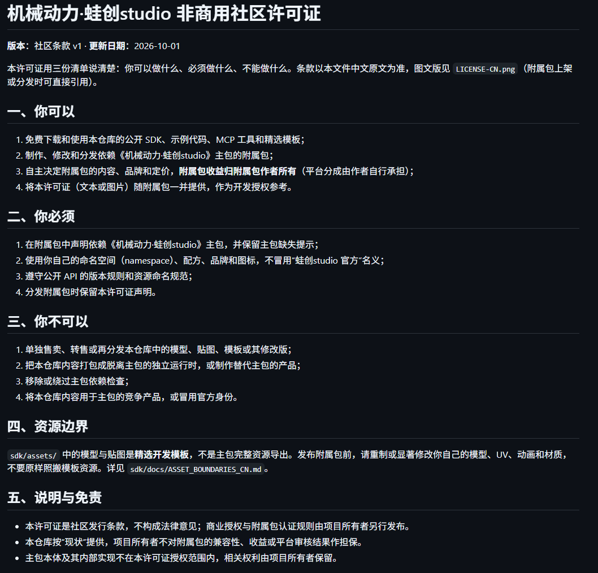

# ⚙️ 机械动力·蛙创studio 开发者生态仓库

> **一句话：官方提供齿轮和动力，你负责创意和玩法——附属包收益 100% 归你。**

你不需要看懂主包的一行代码。机械网络、流体网络、持久化、性能调度这些“脏活”全部由主包负责，
你只需要通过公开 API，把自己的机器、配方和玩法“插”上去——就像给乐高城堡加自己拼的零件。

**公共 API v1** · 主包 `0.0.31+` · 非商用社区许可证

---

## 🎯 30 秒看懂这个仓库

| 你想知道的 | 答案 |
| --- | --- |
| 这是什么？ | 《机械动力·蛙创studio》官方的附属包开发者仓库 |
| 谁适合用？ | 想做机械类附属包的开发者，以及帮你写代码的 AI 编程助手 |
| 能做什么？ | 电力、蒸汽、航空、物流、加工、自动化……围绕主包 API 做你自己的机械扩展 |
| 收益归谁？ | **完全归你**。品牌、内容、定价都由你决定，我们只要求保留主包依赖 |
| 要交钱吗？ | 仓库里所有工具、API 和模板免费使用 |

## 🚀 新手三步上手

### 第 1 步 · 准备环境

在网易我的世界安装并启用《机械动力·蛙创studio》主包（`0.0.31` 或更新版本），装好 MC Studio，然后加入开发者交流群：

- QQ 群：`1125647293`（[一键加群](https://qm.qq.com/q/MJrQ9iNL06)，入群答案：`机械动力·蛙创studio`）
- 群里可以问 API 用法、反馈兼容问题、展示你的作品

### 第 2 步 · 拿走工具

| 工具 | 说人话版介绍 | 去哪拿 |
| --- | --- | --- |
| **MCP EXE** | 给 AI 编程助手（Cursor、Claude Code 等）用的官方工具箱：查 API 目录、生成附属包骨架、生成六向齿轮箱模板、检查模型 UV、生成骨骼动画 | [Releases](https://github.com/wachg-studio/wacreate-developer-sdk/releases) |
| **SDK ZIP** | 能直接复制粘贴的公开 API + 最小注册示例 + 齿轮/齿轮箱模型贴图模板 | [Releases](https://github.com/wachg-studio/wacreate-developer-sdk/releases) |
| **测试包** | 一个 5 分钟“体检包”，导入 MC Studio 就能验证你的开发环境是否正常 | [Releases](https://github.com/wachg-studio/wacreate-developer-sdk/releases) |

### 第 3 步 · 跑通第一个附属包

1. 打开 `sdk/examples/register_mechanical.py`，照着用 `RegisterAddon` + `RegisterMechanicalComponent` 注册一个最小动力节点；
2. 先把测试包导入 MC Studio，确认主包依赖加载和命名空间检查都通过；
3. 然后换成你自己的方块、配方和资源：查 API 目录 → 生成骨架 → 补内容 → 静态校验 → 进游戏测试。

> 💡 MCP 和静态校验不能代替游戏内验证。上架前请自行测试版本兼容、区块重载、动力拓扑和性能预算。

## 🧰 三样工具，分别管什么

- **MCP EXE（AI 助手用）**：任何支持 stdio 的 MCP 客户端都能启动。它只生成文件、只调用公开合同——不执行附属包代码，也不读取主包私有源码。源码在 `mcp/tools/`，使用文档见 `mcp/tools/WACREATE_MCP_CN.md`。
- **公开 SDK（你复制用）**：`sdk/wacreate_sdk/public_api.py` 是 API 的唯一权威入口，方法名、版本规则、缺失主包提示都在里面；`sdk/assets/` 是精选模板，**不是**官方完整资源。
- **测试包（先体检再开工）**：验证 5 件事——主包依赖加载、缺失提示、`RegisterAddon` 登记、`RegisterMechanicalComponent` 注册、目录与命名空间规范。

## 🤝 搭配工具推荐：MCDK-Assistant

除了官方 MCP，再推荐一个开源好搭档 [**MCDK-Assistant**](https://github.com/GitHub-Zero123/mcdk-assistant)（BSD-3-Clause）——面向网易我的世界 / 基岩版开发的通用 MCP Server：

- 🔎 **文档检索**：ModAPI、QuMod、网易教程、Bedrock Wiki，AI 少猜多验证；
- 🧭 **资源速查**：原版资源模糊搜索，JSON UI / 动画 / 模型参考速查；
- 🐍 **代码审查**：Python2 Addon 结构分析与 AI 自查，改完按报告回改，闭环修错；
- ⚡ **免依赖部署**：C++ 原生实现，stdio 直接挂到 AI 客户端，无需 Node.js。

分工很简单：**MCDK-Assistant 管通用的网易开发查资料和代码审查，wacreate MCP 管蛙创专属的 API、模板和校验**。两个一起挂上 AI 助手，从查资料到生成附属包一条龙。

## 🎁 加入生态，你能得到什么

- **稳定接口**：机械节点、应力、视觉动画、护目镜、加工与流体能力都走公共 API，主包升级有版本规则可循；
- **精选模板**：传动杆、大小齿轮、齿轮箱的模型和贴图模板，不用从空白开始；
- **生态展示**：通过兼容检查的附属包，可以申请在知识库、开发者目录和社区公告中展示；
- **需求直达**：缺 API、方向映射不对、动画时序有问题？群里提，后续版本按需求评估；
- **流量协同**：优秀附属包会反哺主包曝光，你的作品就是我们最好的广告；
- **边界清晰**：不交源码、不交收益，只要求保留主包依赖、遵守公共 API 和资源规则。

## 📜 规则（新手版）

✅ **可以**：免费使用 SDK、示例和模板；制作并售卖依赖主包的附属包；收益全归你。
📌 **必须**：声明依赖主包；用自己的命名空间和品牌；遵守公共 API 和命名规范。
🚫 **不可以**：单独售卖官方模型贴图；打包成脱离主包的独立运行时；冒充官方身份。

完整条款见下方图片和 [LICENSE-CN.md](LICENSE-CN.md)。由于模组简介中不能携带外链，**附属包作者上架时可直接引用这张图**作为授权说明：

## 🚫 明确不公开的内容

主包完整源码、机械/流体/物流核心实现、性能调度与内部数据结构、完整官方模型动画材质 UI、服务器配置和密钥——这些都不会进入本仓库。公开 SDK 里的模型贴图是精选开发模板，发布附属包前请重制或显著修改成你自己的资源。

## 📥 下载（全部在 Releases）

- [MCP EXE（Windows）](https://github.com/wachg-studio/wacreate-developer-sdk/releases/download/v0.1.1/wacreate-mcp.exe)
- [公开 SDK ZIP](https://github.com/wachg-studio/wacreate-developer-sdk/releases/download/v0.1.1/wacreate-community-sdk.zip)
- [MC Studio 测试包 ZIP](https://github.com/wachg-studio/wacreate-developer-sdk/releases/download/v0.1.2/wacreate-test-pack.zip)
- 📚 开发者知识库：<https://wachg.xyz/create/api/>

## 💬 建议反馈

MCP、公共 API、模型动画、文档、工作流——任何建议都欢迎：
**<https://wachg.xyz/create/suggest/>**

> 附属包收益完全归创作者，创作者保留品牌、内容和定价；附属包必须依赖机械动力·蛙创主包，不能独立替代主包运行时。
